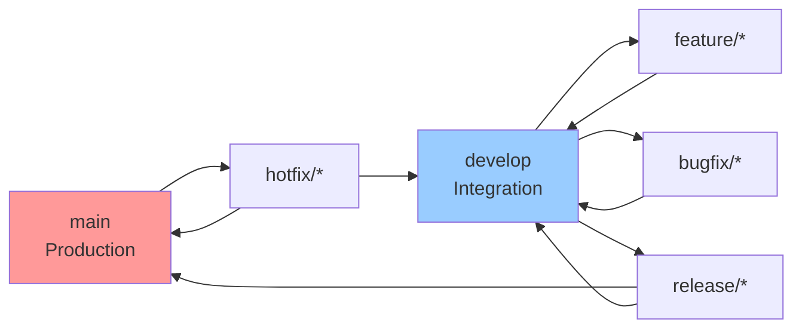

# Save and Release - Gitflow Automation

You will help commit, push, and release changes using the git-flow extension.

## Prerequisites
- Git Flow extension is installed (`git flow` commands available)
- Repository is initialized with `git flow init` (assume default branch names)

## Documentation
For complete git flow command reference, see: `.claude/docs/git/gitflow-commands-reference.md`

## Workflow Steps

### 1. Analyze Arguments and Repository State
**ALWAYS START WITH `git status`** - Never assume file states from conversation!

Parse the provided arguments: `$ARGUMENTS`
- First word should be the flow type: `feature`, `bugfix`, `hotfix`, `release`, or `support`
- Remaining words form the name/version
- If no arguments provided:
  - **Run `git status` first** to check working tree state
  - Check current branch to determine if in an active flow
  - If on feature/bugfix/hotfix branch: finish that flow first
  - Then check for unreleased commits on develop
  - If unreleased commits exist, automatically create and finish a release

### 2. Git Flow Branch Operations

Use git flow commands based on the type. For complete syntax reference, see:
`.claude/docs/git/gitflow-commands-reference.md`

**Quick Command Summary**:
- **Feature**: `git flow feature start <name>` → develop → `finish -p <name>`
- **Bugfix**: `git flow bugfix start <name>` → develop → `finish -p <name>`
- **Hotfix**: `git flow hotfix start <version>` → main+develop → `finish -pm "msg" <version>`
- **Release**: `git flow release start <version>` → main+develop → `finish -pm "msg" <version>`

**Key flags for automation**:
- `-p`: Push to origin after finish
- `-m "message"`: Non-interactive tag message
- `-F`: Fetch before operation

### 3. Pre-operation Checks
**CRITICAL: Always use `git status` to discover actual changes - NEVER assume or guess from conversation history!**

Run these checks before any git flow operation:
- **ALWAYS START WITH**: `git status` to see uncommitted changes and modified files
- `git diff` to review the actual changes in modified files
- `git diff --cached` to see staged changes
- `git flow config` to verify git flow is initialized
- Check current branch with `git branch --show-current`
- Verify no existing flow of same type with `git flow [type] list`
- Read VERSION file if it exists (for version determination)

**Important**: Never assume files have changed based on previous conversation. Always verify with `git status` first!

### 4. Commit Workflow
For features/bugfixes with uncommitted changes:
1. Stage all changes with `git add .`
2. Create semantic commit message:
   - **feature**: `feat: [description]`
   - **bugfix**: `fix: [description]`
   - **hotfix**: `hotfix: [description]`
   - **release**: `chore: prepare release [version]`
3. Include co-author attribution

### 5. Complete Git Flow Workflow

**CRITICAL: All flows must be properly finished!**

First, detect git flow version:
```bash
git flow version
# 0.4.x = original nvie/gitflow (limited flags)
# 1.x.x = AVH Edition (full flag support)
```

**For feature/bugfix flows**:
1. If starting new: `git flow [type] start <name>`
2. Stage and commit all changes: `git add . && git commit -m "message"`
3. **ALWAYS FINISH**: `git flow [type] finish <name>`
4. Push develop: `git push origin develop`
5. Clean up remote: `git push origin --delete [type]/<name>` (if published)
6. **Then check if release is needed** (see step 6)

**For release flows**:
1. **ALWAYS after finishing features/bugfixes**
2. Determine version from commit history
3. `git flow release start <version>`
4. Update VERSION file if exists
5. Commit version changes
6. **FINISH RELEASE**:
   - **AVH Edition**: `git flow release finish -m "Release v<version>" <version>`
   - **Original nvie**: 
     ```bash
     export GIT_MERGE_AUTOEDIT=no
     git flow release finish <version>
     # If tag fails, manually create:
     git tag -a v<version> -m "Release v<version>"
     # Complete merge to develop manually if needed
     ```
7. Push all: `git push --all && git push --tags`
8. Create GitHub release: `gh release create v<version> --generate-notes`

**For hotfix flows**:
Similar to release, but starts from main/master instead of develop.

### 6. Auto-Release Logic (When No Arguments Provided)

**Step 1: Check and finish active flows**:
- If on `feature/*` branch: finish the feature first
- If on `bugfix/*` branch: finish the bugfix first  
- If on `hotfix/*` branch: finish the hotfix first
- If on `release/*` branch: finish the release first

**Step 2: After all flows are finished, check for unreleased commits**:
1. Switch to develop branch
2. Check for commits since last tag
3. Analyze commits to determine version bump:
   - `feat:` commits → minor version bump
   - `fix:` commits → patch version bump  
   - `BREAKING CHANGE:` → major version bump
   
**Step 3: Create and finish release**:
1. `git flow release start -F <version>` (-F fetches latest)
2. Update VERSION file if exists
3. Commit VERSION change: `git add VERSION && git commit -m "chore: bump version to <version>"`
4. **ALWAYS FINISH**: `git flow release finish -pm "Release v<version>" <version>`
5. Push all: `git push --all && git push --tags`
6. Create GitHub release: `gh release create v<version> --generate-notes`

### 7. GitHub Release Creation
After finishing a release or hotfix:
1. The git flow finish creates a tag automatically
2. Push tags with `git push --tags`
3. Create GitHub release: `gh release create v[version] --generate-notes`

## Important Guidelines

### File Discovery Rules
- **ALWAYS use `git status` first** - Never assume which files changed
- **Never guess file states** from previous conversation context
- **Always verify changes** with `git diff` before committing
- **Check both staged and unstaged** changes before proceeding

### Git Flow Rules
- **ALL GIT FLOWS MUST BE FINISHED** - never leave flows open
- Git flow manages branch creation/deletion automatically
- NEVER manually create feature/release/hotfix branches
- Always use `git flow [type] finish` to properly merge and tag
- Features/bugfixes merge to develop, releases/hotfixes merge to both master and develop
- Version tags are created automatically by git flow release/hotfix finish
- **Workflow sequence**: Feature/Bugfix → Finish → Release → Finish → Push
- **After finishing feature/bugfix**: ALWAYS check if a release is needed
- **Never skip the finish step** - it's critical for proper branch management

## Non-Interactive Automation

For fully automated workflows without prompts:
- Set environment variable: `export GIT_MERGE_AUTOEDIT=no`
- Use `-m` flag for tag messages: `git flow release finish -m "Release v1.0.0" 1.0.0`
- Use `-p` flag to auto-push after finish
- For releases/hotfixes, combine flags: `git flow release finish -pm "message" <version>`

## Error Handling

If any step fails:
- Check if git flow is initialized: `git flow init -d` (use -d for defaults)
- Verify you're not already in a flow: `git flow [type] list`
- List all flows: `git flow feature|bugfix|release|hotfix list`
- Ensure working directory is clean before starting flows
- For merge conflicts during finish: Resolve and continue
- To abort a flow: `git flow [type] delete <name>`

## Example Usage

```bash
# Complete feature workflow (start → commit → finish → release)
/save-and-release feature user-authentication
# This will:
# 1. Start feature/user-authentication
# 2. Commit changes
# 3. FINISH the feature (merge to develop)
# 4. Check if release is needed
# 5. If yes, create and FINISH release

# Fix a bug and release
/save-and-release bugfix validation-error
# This will:
# 1. Start bugfix/validation-error
# 2. Commit changes
# 3. FINISH the bugfix
# 4. Check for release necessity

# Emergency fix to production
/save-and-release hotfix 1.2.1
# This will:
# 1. Start hotfix/1.2.1
# 2. Commit changes
# 3. FINISH the hotfix (merge to main AND develop)
# 4. Create GitHub release

# Auto-detect current flow and complete everything
/save-and-release
# This will:
# 1. Detect current branch type
# 2. FINISH current flow if any
# 3. Check for unreleased commits
# 4. Create and FINISH release if needed
```

## Git Flow Branch Model



Remember: Let git flow manage the complexity of branching and merging.