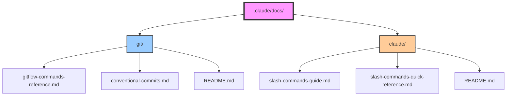

# Documentation Hub

Comprehensive documentation for project tooling, workflows, and best practices.

## 📚 Documentation Categories

### [Git & Version Control](./git/)
Complete git and git-flow documentation:
- **[Git Flow Commands Reference](./git/gitflow-commands-reference.md)** - Complete syntax and usage
- **[Conventional Commits](./git/conventional-commits.md)** - Semantic commit guidelines
- **[README](./git/README.md)** - Git documentation overview

**Key Topics**: Git flow branching, conventional commits, version control workflows, automation

### [Claude Code](./claude/)
Claude Code features and slash commands:
- **[Slash Commands Guide](./claude/slash-commands-guide.md)** - Comprehensive guide
- **[Quick Reference](./claude/slash-commands-quick-reference.md)** - Cheat sheet
- **[README](./claude/README.md)** - Claude documentation overview

**Key Topics**: Custom commands, YAML frontmatter, tool restrictions, best practices

## 🚀 Quick Links

### Essential References
- [Git Flow Quick Commands](./git/gitflow-commands-reference.md#quick-command-summary)
- [Slash Command Template](./claude/slash-commands-quick-reference.md#quick-command-template)
- [Conventional Commits Types](./git/conventional-commits.md#commit-types)
- [YAML Frontmatter Reference](./claude/slash-commands-guide.md#yaml-frontmatter)

### Project Commands
Located in `.claude/commands/`:
- `/save-and-release` - Automated git flow workflow
- `/init-memory-bank` - Initialize project memory system

### Workflows

#### Creating a Slash Command
```bash
# 1. Create command file
echo "Your prompt here" > .claude/commands/my-command.md

# 2. Add frontmatter (optional)
cat > .claude/commands/my-command.md << 'EOF'
---
description: What this command does
allowed-tools: Read, Write
---
Your prompt here
EOF

# 3. Use it
/my-command
```

#### Git Flow Workflow
```bash
# Feature development
git flow feature start my-feature
# ... make changes ...
git add . && git commit -m "feat: add feature"
git flow feature finish my-feature

# Release
git flow release start 1.0.0
# ... prepare release ...
git flow release finish 1.0.0
```

## 📊 Documentation Map



## 🔧 Tool References

### Available Claude Code Tools
| Tool | Purpose | Documentation |
|------|---------|---------------|
| `Bash` | Execute commands | [Tool Restrictions](./claude/slash-commands-guide.md#tool-restrictions) |
| `Read` | Read files | [File Inclusion](./claude/slash-commands-guide.md#3-file-inclusion-with-) |
| `Write` | Create files | [Security](./claude/slash-commands-guide.md#security-considerations) |
| `Edit` | Modify files | [Best Practices](./claude/slash-commands-guide.md#best-practices) |
| `Grep` | Search content | - |
| `Glob` | Find files | - |
| `LS` | List directories | - |

### Git Flow Commands Summary
| Flow | Start | Finish | Purpose |
|------|-------|--------|---------|
| feature | `git flow feature start <name>` | `git flow feature finish <name>` | New features |
| bugfix | `git flow bugfix start <name>` | `git flow bugfix finish <name>` | Bug fixes |
| release | `git flow release start <version>` | `git flow release finish <version>` | Releases |
| hotfix | `git flow hotfix start <version>` | `git flow hotfix finish <version>` | Emergency fixes |

## 📖 Learning Path

### For New Team Members
1. Start with [Git Flow Overview](./git/README.md)
2. Learn [Conventional Commits](./git/conventional-commits.md)
3. Understand [Slash Commands Basics](./claude/slash-commands-quick-reference.md)
4. Practice with `/save-and-release` command

### For Advanced Users
1. Master [YAML Frontmatter](./claude/slash-commands-guide.md#yaml-frontmatter)
2. Study [Advanced Features](./claude/slash-commands-guide.md#advanced-features)
3. Implement [Security Best Practices](./claude/slash-commands-guide.md#security-considerations)
4. Create custom workflow commands

## 🤝 Contributing

### Adding Documentation
1. Create markdown file in appropriate subdirectory
2. Update this README with links
3. Follow existing format and style
4. Include practical examples

### Documentation Standards
- Use clear headings and structure
- Include code examples
- Add mermaid diagrams where helpful
- Link between related documents
- Keep content up-to-date

## 📅 Version History

| Date | Version | Changes |
|------|---------|---------|
| 2025-01 | 1.0.0 | Initial documentation structure |
| 2025-01 | 1.1.0 | Added slash commands documentation |
| 2025-01 | 1.2.0 | Added git flow documentation |
| 2025-01 | 1.3.0 | Added this index file |

## 🔗 External Resources

### Official Documentation
- [Anthropic Claude Code](https://docs.anthropic.com/en/docs/claude-code)
- [Git Flow Model](https://nvie.com/posts/a-successful-git-branching-model/)
- [Conventional Commits](https://www.conventionalcommits.org/)

### Community Resources
- [Awesome Claude Code](https://github.com/hesreallyhim/awesome-claude-code)
- [Git Flow Cheatsheet](https://danielkummer.github.io/git-flow-cheatsheet/)

## 💡 Tips & Tricks

### Slash Commands
- Start with personal commands (`~/.claude/commands/`) for testing
- Use `model: haiku` for simple tasks to save costs
- Combine `!` and `@` for powerful context gathering

### Git Flow
- Always finish flows - never leave branches hanging
- Use semantic commit messages for automatic versioning
- The pre-commit hook enforces gitflow usage

### Documentation
- This directory is version controlled
- Changes should be reviewed in PRs
- Keep examples realistic and tested

---

*This documentation hub is part of the ai-assistant-simple project. For project-specific information, see the [memory bank](./../memory/).*