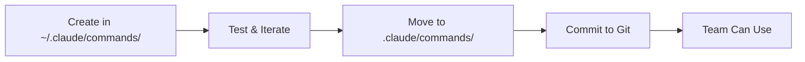

# Claude Code Documentation

This directory contains comprehensive documentation for Claude Code features and best practices.

## Available Documentation

### [Slash Commands Guide](./slash-commands-guide.md)
Complete guide to creating and managing custom slash commands:
- Command types and structure
- YAML frontmatter reference
- Advanced features and patterns
- Security and best practices
- Troubleshooting

### [Slash Commands Quick Reference](./slash-commands-quick-reference.md)
Quick reference card for slash commands:
- Frontmatter cheat sheet
- Special syntax reference
- Common patterns
- Quick command template

## Related Project Commands

This project includes example slash commands in `.claude/commands/`:

| Command | Description | Key Features |
|---------|-------------|--------------|
| `/save-and-release` | Git flow automation | Complex workflow, version detection |
| `/init-memory-bank` | Initialize memory system | File creation, directory structure |

## Quick Start

### Creating Your First Command

1. **Create command file:**
   ```bash
   echo "Review this PR for best practices" > .claude/commands/review-pr.md
   ```

2. **Add frontmatter (optional):**
   ```yaml
   ---
   description: Review PR for code quality
   allowed-tools: Read, Grep
   ---
   ```

3. **Use the command:**
   ```
   /review-pr
   ```

### Command Development Workflow



## Best Practices Summary

### 🎯 Command Design
- Single responsibility per command
- Clear, action-oriented names
- Include helpful argument hints
- Document expected behavior

### 🔒 Security
- Restrict tools to minimum needed
- Never allow unrestricted Bash access
- Validate all user inputs
- Limit file system access

### 🚀 Performance
- Use appropriate AI models
- Minimize bash executions
- Cache when possible
- Avoid expensive operations

### 👥 Collaboration
- Version control project commands
- Document in team wiki
- Review command changes in PRs
- Share successful patterns

## Common Use Cases

### 1. Git Workflows
```markdown
---
description: Smart commit
allowed-tools: Bash(git:*)
---
Create conventional commit based on:
!`git diff --cached`
```

### 2. Code Review
```markdown
---
description: Security review
allowed-tools: Read, Grep
model: opus
---
Review for security vulnerabilities
```

### 3. Testing
```markdown
---
description: Run and fix tests
allowed-tools: Bash(npm test), Edit
---
Run tests and fix any failures
```

### 4. Documentation
```markdown
---
description: Generate docs
allowed-tools: Read, Write
---
Generate API documentation
```

## Tool Permissions Reference

| Tool | Purpose | Example Restriction |
|------|---------|-------------------|
| `Bash` | Execute commands | `Bash(git:*)` |
| `Read` | Read files | `Read(./src/*)` |
| `Write` | Create files | `Write(./docs/*)` |
| `Edit` | Modify files | `Edit` |
| `Grep` | Search files | `Grep` |
| `Glob` | Find files | `Glob` |
| `LS` | List directories | `LS` |

## Frontmatter Fields

| Field | Required | Purpose | Example |
|-------|----------|---------|---------|
| `description` | No | Shows in /help | `"Run tests"` |
| `argument-hint` | No | Argument guide | `"[branch]"` |
| `allowed-tools` | No | Tool restrictions | `"Read, Write"` |
| `model` | No | AI model selection | `"sonnet"` |

## Resources

### Official Documentation
- [Anthropic Slash Commands](https://docs.anthropic.com/en/docs/claude-code/slash-commands)
- [Claude Code Overview](https://docs.anthropic.com/en/docs/claude-code/overview)
- [Settings & Configuration](https://docs.anthropic.com/en/docs/claude-code/settings)

### Community Resources
- [Awesome Claude Code](https://github.com/hesreallyhim/awesome-claude-code)
- Share your commands and patterns!

## Contributing

To add new commands to this project:

1. Create command in `.claude/commands/`
2. Test thoroughly
3. Document in this README if it's a key workflow
4. Submit PR with clear description

## FAQ

**Q: Can I use environment variables in commands?**
A: No direct support, but you can use bash execution: `` !`echo $MY_VAR` ``

**Q: How do I debug a command?**
A: Start simple, add features incrementally, check frontmatter syntax

**Q: Can commands call other commands?**
A: Not directly, but you can reference shared patterns

**Q: What's the command size limit?**
A: No hard limit, but keep commands focused and concise

**Q: Can I use commands in CI/CD?**
A: Yes, with `--no-interactive` flag in Claude Code CLI

## Version History

- v1.0.0 - Initial slash commands documentation
- Based on Claude Code documentation as of January 2025

---

*This documentation is maintained as part of the ai-assistant-simple project.*