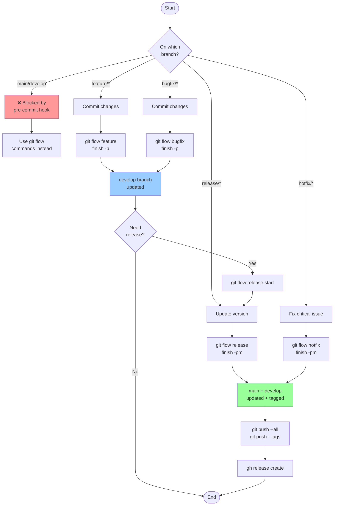

# Git Documentation

This directory contains comprehensive git and git-flow documentation for the project.

## Available Documentation

### [Git Flow Commands Reference](./gitflow-commands-reference.md)
Complete syntax reference for git-flow extension commands including:
- Installation and initialization
- Feature, bugfix, release, hotfix, and support branches
- Command flags and options
- Non-interactive automation
- Troubleshooting

### [Conventional Commits](./conventional-commits.md)
Guidelines for semantic commit messages:
- Commit types and their version impacts
- Breaking changes notation
- Scope usage
- Integration with git flow
- Validation tools

## Git Flow Visual Overview



## Quick Reference

### Git Flow + Conventional Commits

| Flow Type | Branch Prefix | Commit Type | Merges To | Creates Tag |
|-----------|--------------|-------------|-----------|-------------|
| feature | `feature/` | `feat:` | develop | No |
| bugfix | `bugfix/` | `fix:` | develop | No |
| release | `release/` | `chore:` | main + develop | Yes |
| hotfix | `hotfix/` | `fix:` or `hotfix:` | main + develop | Yes |

### Automated Workflow Example

```bash
# Start feature with fetch
git flow feature start -F user-auth

# Make changes with conventional commits
git add .
git commit -m "feat: implement JWT authentication"

# Finish feature with auto-push
git flow feature finish -p user-auth

# Create release with version bump
git flow release start 1.1.0
git commit -am "chore: bump version to 1.1.0"
git flow release finish -pm "Release v1.1.0" 1.1.0

# Push everything
git push --all && git push --tags
```

## Project-Specific Configuration

### Pre-commit Hook
The project includes a pre-commit hook (`.githooks/pre-commit`) that:
- Blocks direct commits to main/master/develop
- Enforces git flow usage
- Provides prompt injection for AI assistants

### Slash Commands
- `/save-and-release`: Automated git flow workflow command
- See `.claude/commands/save-and-release.md` for details

## Best Practices

1. **Always use git flow** for branch management
2. **Follow conventional commits** for clear history
3. **Finish all flows** - never leave branches hanging
4. **Use automation flags** (`-p`, `-m`) for CI/CD
5. **Tag releases properly** with semantic versioning
6. **Clean up remote branches** after merging

## Resources

- [Git Flow Original Model](https://nvie.com/posts/a-successful-git-branching-model/)
- [Git Flow AVH Edition](https://github.com/petervanderdoes/gitflow-avh)
- [Conventional Commits Spec](https://www.conventionalcommits.org/)
- [Semantic Versioning](https://semver.org/)