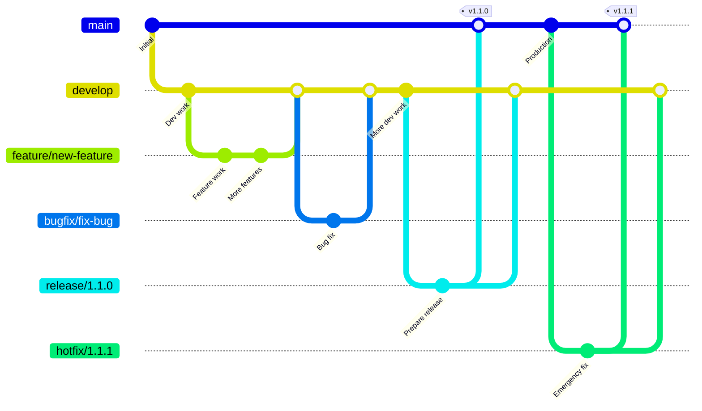
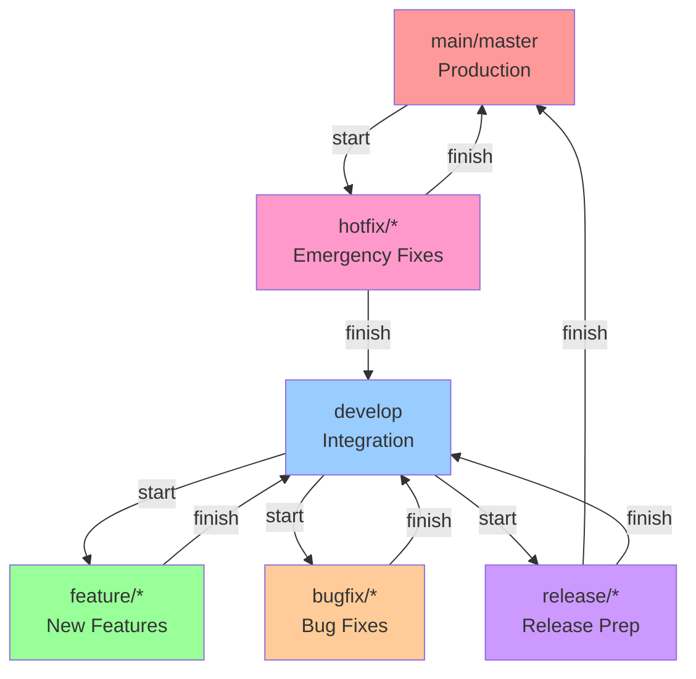

# Git Flow Commands Reference

Complete syntax reference for git-flow extension commands.

## Installation & Initialization

```bash
# Install git-flow (macOS)
brew install git-flow-avh

# Initialize git flow in repository
git flow init              # Interactive setup
git flow init -d           # Use default branch names
```

Default branch names:
- Production: `main` or `master`
- Development: `develop`
- Feature prefix: `feature/`
- Bugfix prefix: `bugfix/`
- Release prefix: `release/`
- Hotfix prefix: `hotfix/`
- Support prefix: `support/`

## Feature Branches

Develop new features isolated from the main codebase.

```bash
# List features
git flow feature                          # List all features
git flow feature list [-v]                # Verbose list

# Start feature
git flow feature start [-F] <name> [<base>]
# -F: Fetch from origin before starting
# <name>: Feature name (required)
# <base>: Base branch (default: develop)

# Finish feature
git flow feature finish [-rFkp] <name>
# -r: Rebase instead of merge
# -F: Fetch from origin before finishing
# -k: Keep branch after finish
# -p: Push to origin after finish

# Publish/track features
git flow feature publish <name>           # Push feature to remote
git flow feature track <name>             # Track remote feature
git flow feature pull <remote> [<name>]   # Pull feature from remote

# Other operations
git flow feature checkout <name>          # Switch to feature branch
git flow feature diff [<name>]            # Show changes
git flow feature rebase [-i] [<name>]     # Rebase feature
git flow feature delete <name>            # Delete feature branch
```

## Bugfix Branches

Fix bugs in the develop branch (AVH Edition 1.9.0+).

```bash
# List bugfixes
git flow bugfix                           # List all bugfixes
git flow bugfix list [-v]                 # Verbose list

# Start bugfix
git flow bugfix start [-F] <name> [<base>]
# Same flags as feature

# Finish bugfix
git flow bugfix finish [-Frpk] <name>
# Same flags as feature

# Publish/track bugfixes
git flow bugfix publish <name>            # Push bugfix to remote
git flow bugfix track <name>              # Track remote bugfix

# Other operations
git flow bugfix checkout <name>           # Switch to bugfix branch
git flow bugfix diff [<name>]             # Show changes
git flow bugfix rebase [-i] [<name>]      # Rebase bugfix
git flow bugfix delete <name>             # Delete bugfix branch
```

## Release Branches

Prepare new production releases.

```bash
# List releases
git flow release                          # List all releases
git flow release list [-v]                # Verbose list

# Start release
git flow release start [-F] <version>
# -F: Fetch from origin before starting
# <version>: Version number (required)

# Finish release
git flow release finish [-Fsumpk] <version>
# -F: Fetch from origin before finishing
# -s: Sign the release tag cryptographically
# -u <key>: Use given GPG key for signing (implies -s)
# -m <msg>: Use given tag message (non-interactive)
# -p: Push to origin after finish
# -k: Keep branch after finish
# -n: Don't tag this release

# Publish/track releases
git flow release publish <name>           # Push release to remote
git flow release track <name>             # Track remote release

# Other operations
git flow release delete <name>            # Delete release branch
```

## Hotfix Branches

Emergency fixes to production.

```bash
# List hotfixes
git flow hotfix                           # List all hotfixes
git flow hotfix list [-v]                 # Verbose list

# Start hotfix
git flow hotfix start [-F] <version> [<base>]
# -F: Fetch from origin before starting
# <version>: Version number (required)
# <base>: Base branch (default: master/main)

# Finish hotfix
git flow hotfix finish [-Fsumpk] <version>
# Same flags as release finish
# Merges to BOTH master and develop

# Other operations
git flow hotfix delete <name>             # Delete hotfix branch
```

## Support Branches

Long-term support for older versions (EXPERIMENTAL).

```bash
# List support branches
git flow support                          # List all support branches
git flow support list [-v]                # Verbose list

# Start support branch
git flow support start [-F] <version> <base>
# -F: Fetch from origin before starting
# <version>: Version number (required)
# <base>: Base commit/tag (required)

# Note: Support branches are never merged back
```

## Common Flag Reference

### Action Flags
- `-F`: Fetch from origin before performing action
- `-r`: Rebase instead of merge (feature/bugfix only)
- `-p`: Push to origin after performing finish
- `-k`: Keep branch after finish (don't delete)
- `-D`: Force delete branch

### Tagging Flags (release/hotfix)
- `-s`: Sign the tag cryptographically (GPG)
- `-u <key>`: Use specific GPG key for signing (implies -s)
- `-m <msg>`: Use given tag message (non-interactive)
- `-n`: Don't create a tag

### Interactive Flags
- `-i`: Interactive rebase

## Non-Interactive Automation

For CI/CD and scripting:

```bash
# Disable merge message editor
export GIT_MERGE_AUTOEDIT=no

# Non-interactive release finish
git flow release finish -m "Release v1.0.0" 1.0.0

# Non-interactive with push
git flow release finish -pm "Release v1.0.0" 1.0.0

# Non-interactive hotfix
git flow hotfix finish -pm "Hotfix v1.0.1" 1.0.1
```

## Workflow Patterns

### Complete Feature Workflow
```bash
git flow feature start my-feature         # Start feature
# ... make changes and commits ...
git flow feature publish my-feature       # Share with team
git flow feature finish -p my-feature     # Finish and push
```

### Complete Release Workflow
```bash
git flow release start 1.0.0             # Start release
# ... update version, changelog ...
git commit -am "chore: prepare release 1.0.0"
git flow release finish -pm "Release v1.0.0" 1.0.0
git push --tags                          # Push tags
```

### Emergency Hotfix Workflow
```bash
git flow hotfix start 1.0.1              # Start from production
# ... fix critical bug ...
git commit -am "fix: critical security issue"
git flow hotfix finish -pm "Hotfix v1.0.1" 1.0.1
```

## Branch Model



### Simplified Flow Diagram



## Troubleshooting

```bash
# Check git flow configuration
git flow config

# List all active flows
git flow feature list
git flow bugfix list
git flow release list
git flow hotfix list

# Check current branch
git branch --show-current

# Abort/delete a flow
git flow feature delete <name>
git flow release delete <name>

# Reset to clean state
git checkout develop
git branch -D feature/abandoned-feature

# Check git flow version
git flow version
```

## Best Practices

1. **Always fetch before starting**: Use `-F` flag
2. **Always finish flows**: Never leave branches hanging
3. **Use meaningful names**: `feature/user-auth` not `feature/stuff`
4. **Tag messages matter**: Use descriptive release messages
5. **Push after finish**: Use `-p` flag or push manually
6. **Clean up remotes**: Delete merged remote branches
7. **One flow at a time**: Finish current flow before starting another

## Git Flow vs Raw Git Commands

| Git Flow | Equivalent Git Commands |
|----------|------------------------|
| `git flow feature start foo` | `git checkout -b feature/foo develop` |
| `git flow feature finish foo` | `git checkout develop`<br>`git merge --no-ff feature/foo`<br>`git branch -d feature/foo` |
| `git flow release start 1.0` | `git checkout -b release/1.0 develop` |
| `git flow release finish 1.0` | `git checkout master`<br>`git merge --no-ff release/1.0`<br>`git tag -a v1.0`<br>`git checkout develop`<br>`git merge --no-ff release/1.0`<br>`git branch -d release/1.0` |